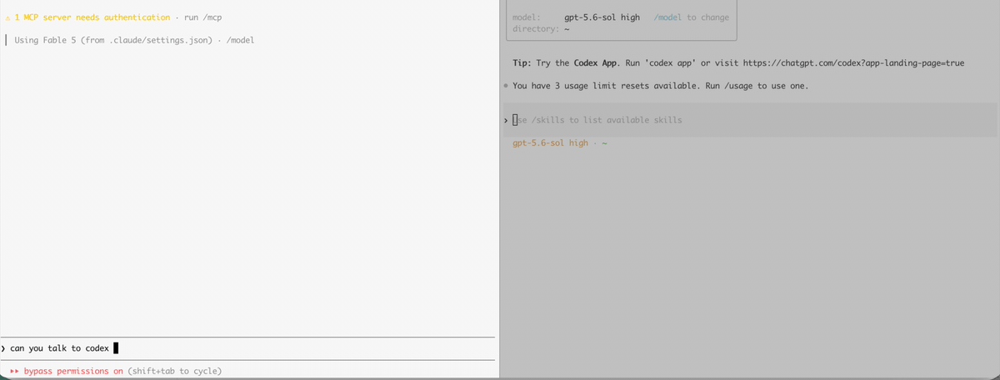

# termbus

**Your iTerm2 panes can see and talk to each other.**

You've got Claude Code in one pane, Codex in another, a dev server in a third. Today they're strangers. termbus makes them a team: any pane can read another's screen, send it a prompt, wait for its answer — and knows when an agent is busy or stuck at a permission prompt.



```sh
npm install -g termbus
termbus install-skill   # teaches Claude Code to use it
```

No daemon. No hooks. No config. It observes the sessions you already have open — if you close termbus, nothing dies.

## What you can do

```sh
termbus list                              # every pane: claude/codex/shell, idle/busy/input!
termbus ask "worker" "run the tests and summarize failures" --timeout 300
termbus send w1.t2.p1 "also add edge-case tests" --queue    # busy agent? lands in its input queue
termbus check "dev server"                # read any pane's screen without touching it
termbus watch --notify                    # macOS alert when any agent needs you
```

Or don't type any of this — after `install-skill`, just tell your Claude:
*"ask the codex terminal to review my diff"* and it handles the rest.

## Why it's different

- **Attaches to your existing panes.** Other tools spawn and own their sessions; termbus observes the terminal you already work in. Close it, nothing dies.
- **Knows when an agent is stuck.** Permission prompts (`Do you want to proceed?`) are detected as a third state — `input!` — not mistaken for idle. `ask` returns early with the dialog and the exact keys to answer it, or auto-approves with `--on-permission approve` (opt-in, capped).
- **Never interrupts by default.** Busy agents refuse messages unless you choose: `--queue` (their native input queue — they see it mid-turn), `--wait` (deliver when idle), or `--force`.
- **Agents know who's talking.** Messages carry a sender envelope (`[termbus-msg v=1 from=w1.t1.p2 kind=claude …]`) so a receiving agent can reply to the right pane — and never mistakes a peer for its human.
- **Works across models.** Claude Code, Codex, plain shells, dev servers — one interface. New agent TUIs are a few regexes to add.

## How it works

AppleScript automation reads pane screens and types into sessions; `ps` on each pane's tty identifies the occupant. Shell commands are wrapped in sentinels that carry the exit code; agent prompts poll the TUI's busy/idle/prompt chrome. Long answers use `--mailbox`: the agent writes its full reply to a file instead of the screen.

## Requirements

- macOS + iTerm2 (grant Automation permission on first use)
- Node ≥ 20

## Busy panes

Sending to a busy pane refuses by default. Opt into one of:

- `--queue` — deliver into a busy agent's native input queue; termbus reports `queued` so the sender knows it isn't handled yet
- `--wait [--timeout S]` — poll until the pane goes idle, then deliver; also waits out a foreground command in a shell pane
- `--force` — interrupt regardless

## Permission prompts

Agents block on modal dialogs (tool permissions, trust prompts). termbus sees them: `list` shows `input!`, `ask` exits with code 5 plus the dialog and how to answer it (`send <target> --raw '\r'` approve / `--raw '\e'` reject). `ask --on-permission approve` auto-confirms for trusted unattended tasks. `termbus watch` runs in its own pane and fires a macOS notification (`--notify`) or queues a heads-up to a supervisor pane (`--push`) when anything needs attention.

## Safety

- Never interrupts a busy agent (refuses; `--queue`/`--wait` to defer, `--force` to override)
- Never targets its own pane, never auto-answers a dialog unless you opted in
- After a timeout it tells the caller to `check`, never to re-send

## Roadmap

tmux / kitty / WezTerm backends · hook-based event feed · message ledger with groups & broadcast · remote control (see it from your phone). Roadmap is pulled by users — [open an issue](https://github.com/ibaad-syed/termbus/issues) with what you'd use.

Backends implement a 3-method interface (`listPanes/readScreen/sendText`) — contributions welcome.

## License

MIT
